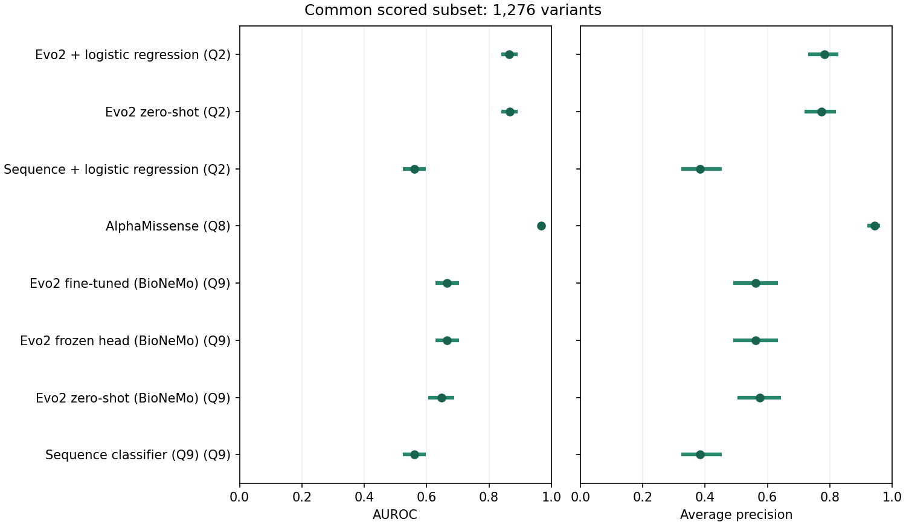

# Pesho's Pathogenicity Predictor

A small research project for predicting the pathogenicity of **missense variants**
using ClinVar data.

<!-- comparison:start -->
## Method comparison

Compare methods on Q1’s frozen missense validation set.

**1,342 missense validation variants · ClinVar labels**

| Method | Notebook | Scored / validation | AUROC [95% CI] | Average precision [95% CI] |
| --- | --- | --- | --- | --- |
| Evo2 + logistic regression | [Q2](notebooks/Q2-evo2-classifier.ipynb) | 1,342 / 1,342 | 0.861 [0.834, 0.885] | 0.775 [0.719, 0.822] |
| Evo2 zero-shot | [Q2](notebooks/Q2-evo2-classifier.ipynb) | 1,342 / 1,342 | 0.866 [0.840, 0.890] | 0.769 [0.713, 0.817] |
| Sequence + logistic regression | [Q2](notebooks/Q2-evo2-classifier.ipynb) | 1,342 / 1,342 | 0.563 [0.529, 0.598] | 0.390 [0.330, 0.455] |
| SIFT4G | [Q8](notebooks/Q8-existing-tools.ipynb) | — | — | — |
| PolyPhen-2 | [Q8](notebooks/Q8-existing-tools.ipynb) | — | — | — |
| REVEL | [Q8](notebooks/Q8-existing-tools.ipynb) | — | — | — |
| AlphaMissense | [Q8](notebooks/Q8-existing-tools.ipynb) | 1,276 / 1,342 | 0.967 [0.958, 0.976] | 0.943 [0.922, 0.960] |
| EVE | [Q8](notebooks/Q8-existing-tools.ipynb) | — | — | — |
| PrimateAI-3D | [Q8](notebooks/Q8-existing-tools.ipynb) | — | — | — |
| Evo2 fine-tuned (BioNeMo) | [Q9](notebooks/Q9-evo2-finetuning.ipynb) | 1,342 / 1,342 | 0.654 [0.614, 0.690] | 0.552 [0.475, 0.618] |
| Evo2 frozen head (BioNeMo) | [Q9](notebooks/Q9-evo2-finetuning.ipynb) | 1,342 / 1,342 | 0.654 [0.614, 0.690] | 0.552 [0.475, 0.618] |
| Evo2 zero-shot (BioNeMo) | [Q9](notebooks/Q9-evo2-finetuning.ipynb) | 1,342 / 1,342 | 0.646 [0.603, 0.684] | 0.573 [0.500, 0.639] |
| Sequence classifier (Q9) | [Q9](notebooks/Q9-evo2-finetuning.ipynb) | 1,342 / 1,342 | 0.563 [0.529, 0.598] | 0.390 [0.330, 0.455] |



**Direct comparison on the same variants**

| Method | Shared variants | AUROC [95% CI] | Average precision [95% CI] |
| --- | --- | --- | --- |
| Evo2 + logistic regression (Q2) | 1276 | 0.866 [0.839, 0.892] | 0.782 [0.730, 0.827] |
| Evo2 zero-shot (Q2) | 1276 | 0.866 [0.839, 0.892] | 0.772 [0.718, 0.819] |
| Sequence + logistic regression (Q2) | 1276 | 0.560 [0.525, 0.597] | 0.384 [0.323, 0.454] |
| AlphaMissense (Q8) | 1276 | 0.967 [0.958, 0.976] | 0.943 [0.920, 0.961] |
| Evo2 fine-tuned (BioNeMo) (Q9) | 1276 | 0.664 [0.628, 0.704] | 0.562 [0.489, 0.634] |
| Evo2 frozen head (BioNeMo) (Q9) | 1276 | 0.664 [0.628, 0.704] | 0.562 [0.489, 0.634] |
| Evo2 zero-shot (BioNeMo) (Q9) | 1276 | 0.647 [0.605, 0.688] | 0.576 [0.503, 0.643] |
| Sequence classifier (Q9) (Q9) | 1276 | 0.560 [0.525, 0.597] | 0.384 [0.323, 0.454] |

<details>
<summary>Provenance, missing results and limitations</summary>

| Method | Details |
| --- | --- |
| Evo2 + logistic regression (Q2) | Development result; validation participates in model selection. |
| Evo2 zero-shot (Q2) | Development result; validation participates in model selection. |
| Sequence + logistic regression (Q2) | Development result; validation participates in model selection. |
| SIFT4G (Q8) | Surveyed tool; no pilot predictions exported. |
| PolyPhen-2 (Q8) | Surveyed tool; no pilot predictions exported. |
| REVEL (Q8) | Surveyed tool; no pilot predictions exported. |
| AlphaMissense (Q8) | ClinVar calibration overlap unresolved; maximum matching transcript score. |
| EVE (Q8) | Surveyed tool; no pilot predictions exported. |
| PrimateAI-3D (Q8) | Surveyed tool; no pilot predictions exported. |
| Evo2 fine-tuned (BioNeMo) (Q9) | Development result; validation participates in model selection. |
| Evo2 frozen head (BioNeMo) (Q9) | Development result; validation participates in model selection. |
| Evo2 zero-shot (BioNeMo) (Q9) | Development result; validation participates in model selection. |
| Sequence classifier (Q9) (Q9) | Development result; validation participates in model selection. |

```json
{
  "cohort": {
    "protocol_sha256": "0b1b21eb6fb829884d1f8bd09c0314a34ae2acddb018f239d6346f7933566409",
    "vcf_exports": {
      "clinvar-test-pilot.vcf": "1007a3b5229199203c1174e78d430ad0195b9f33ea258af1829077223e72f4eb",
      "clinvar-train-pilot.vcf": "db7bf9cd1b743e2a9f7045a7053f268b9f568dd9726347af286e224c1b572ea6"
    },
    "validation_variants": 1342
  },
  "source_errors": {},
  "bootstrap": {
    "repetitions": 1000,
    "seed": 42
  },
  "generated_utc": "2026-09-07T16:55:22.738866+00:00"
}
```

</details>

**Conclusion.** Use the common-subset comparison to assess methods; coverage remains a separate limitation.

These are development results: validation participates in model selection. AlphaMissense has unresolved ClinVar calibration overlap. The 95% intervals resample whole Q1 components and do not correct selection bias or establish clinical validity.
<!-- comparison:end -->

## Research questions

These questions support the [project goals](GOALS.md): ClinVar missense pathogenicity
prediction, using frozen Evo2 representations or light fine-tuning. Evo2 already has
published variant-effect results, so the strongest contribution would address
generalization, reliability, and when its representations add value.
([Evo2 paper](https://www.nature.com/articles/s41586-026-10176-5))

### [Q0. What does ClinVar contain about missense variants, and which are suitable for reliable evaluation?](notebooks/Q0-clinvar-summary.ipynb)

Explore missense annotations, genes, pathogenicity labels, review status, missing
annotations, conflicting classifications, and duplicate or related records.
Use plots to reveal class imbalance and potential leakage, then define a
missense-only dataset and filtering criteria.

### [Q1. How should ClinVar missense variants be split for reliable evaluation on previously unseen genes?](notebooks/Q1-clinvar-split.ipynb)

Build a 5,000-variant pilot from the September snapshot's 65,270 eligible missense
SNVs using Q0's quality filters and the exact ClinVar `MC` annotation `SO:0001583`. Explain how genes, loci, source
IDs and overlapping or identical sequence contexts connect variants into groups;
preserve all earlier group assignments to training and validation. Visualize the split sizes, verify
separation and export `data/clinvar-train-pilot.vcf` and `data/clinvar-test-pilot.vcf` as the
fixed inputs for all later experiments. The latter file contains validation data.

### [Q2. Can a small classifier on frozen Evo2 representations outperform zero-shot Evo2 scoring for missense variants in previously unseen genes?](notebooks/Q2-evo2-classifier.ipynb)

Compare logistic regression on frozen Evo2 1B representations with zero-shot
scores and a DNA-only sequence baseline: missense SNVs, 1,024-base contexts,
gene-disjoint splits, and paired component bootstrap intervals. Genes, source
IDs, loci and overlapping contexts are grouped across the full cohort before
sampling; identical pilot contexts, including reverse complements, also stay
together. Clinical annotations are excluded from predictor features.

Use Q1's training VCF for fitting and its validation VCF for model selection and
comparison. A separate untouched holdout is required for final performance claims.

### Q3. How much does apparent missense predictive performance depend on similarities between training and test data?

Compare conventional random splits with progressively stricter locus-,
sequence-context-, and gene-separated splits. Treat random splits as a diagnostic
benchmark; quantify how much performance survives credible leakage controls.

### Q4. Does longer sequence context improve missense pathogenicity prediction?

Vary context length while holding the checkpoint, classifier, and evaluation
missense variants fixed. Measure predictive gains and computational cost, with
gene-level comparisons where sample sizes permit.

### Q5. Is it better to train on fewer strongly supported ClinVar missense labels or more labels with weaker supporting evidence?

Compare training sets filtered by review status, including size-matched
comparisons, against a fixed, strongly reviewed holdout. ClinVar's review status
captures review processes and agreement, making this a useful test of label
selection.
([ClinVar documentation](https://www.ncbi.nlm.nih.gov/clinvar/docs/review_status/))

### Q6. Can the predictor identify when its missense predictions are unreliable?

Evaluate calibration and whether withholding low-confidence predictions reduces
errors on unseen genes. Report the relationship between retained coverage and
error rate, alongside discrimination metrics.

### Q7. Can a model trained on an older ClinVar snapshot predict subsequently resolved missense variants of uncertain significance?

Freeze training labels at an earlier release and evaluate variants that later
receive clear classifications. This requires historical snapshots and careful
provenance checks, but would test usefulness beyond reproducing existing labels.

### [Q8. What in silico tools currently exist for predicting missense variant pathogenicity, and which are suitable baselines for this project?](notebooks/Q8-existing-tools.ipynb)

Compare six missense-specific predictors and set up AlphaMissense as the reference
baseline. Automatically download its pinned GRCh38 scores, match Q1's fixed pilot
alleles, and report coverage and validation performance with component-bootstrap
intervals. ClinVar remains the ground truth; AlphaMissense's clinical calibration
exposure limits independence claims.

### [Q9. Can light fine-tuning of Evo2 improve missense pathogenicity prediction compared with frozen representations and zero-shot scoring?](notebooks/Q9-evo2-finetuning.ipynb)

Train Hyena block 23 alongside a classification head, keeping attention block 24 frozen,
using Q1's fixed pilot partitions and Q2's checkpoint and sequence contexts.
Compare validation performance, training time and GPU memory with frozen and
zero-shot baselines produced by the same BioNeMo model, plus a sequence baseline.
Use the [pinned BioNeMo tutorial](https://github.com/NVIDIA-BioNeMo/bionemo-recipes/blob/ca16c2acf9bf813d020b6d1e2d4e1240cfef6a69/docs/docs/user-guide/examples/bionemo-evo2/fine-tuning-tutorial.ipynb)
as the training scaffold, adding selective weight updates and supervised missense classification.

## Data

Q0 automatically downloads the dated **6 July 2026** ClinVar snapshot into `data/`
when missing. Q1/Q2 retain their separately pinned **5 September 2026** pilot input.
See [data/README.md](data/README.md) for filenames and checksum checks. Q1 also writes the two shared VCF
partitions to `data/`; other generated files live under `notebooks/results/`.
Generated artifacts are described in [results documentation](notebooks/results/README.md).

## Machine configuration

Observed on 2026-09-07 in the current container/VM. These are the resources
visible to this environment, not minimum project requirements.

- **GPU:** 1 NVIDIA L40S, 46,068 MiB VRAM; NVIDIA driver 565.57.01.
- **CPU:** AMD EPYC 9254; 8 logical CPUs exposed (4 cores, 2 threads per core),
  x86_64, KVM virtualization.
- **Memory:** 144 GiB RAM; no swap.
- **Storage:** project resides on a 124 GiB overlay filesystem.
- **OS:** Ubuntu 24.04.2 LTS; Linux kernel 5.15.0-126-generic.
- **Python:** 3.12.3 at `/usr/bin/python`.
- **GPU software:** CUDA toolkit 12.9 (`nvcc` 12.9.41), PyTorch CUDA build 12.9,
  cuDNN 9.9.0.

The system Python is externally managed (PEP 668): direct `pip install` commands
are blocked. Use a virtual environment and its Jupyter kernel for package
changes.
